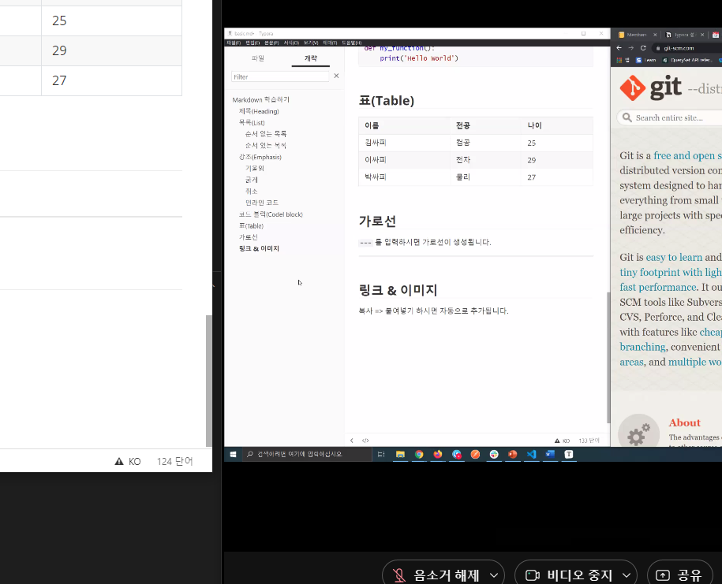

# Markdown 학습하기

## 제목(헤딩)

ㅁ님어니ㅏ엄ㅇㄴ
가장 큰 제목부터 6번째까지 존재

#의 갯수로 제못의 중요도를 지정

## 목록

순서가 있는 목록(오더드리스트), 순서가 없는 목록(언오더드 리스트)가 있다.

### 순서 없는 목록
-혹은 *를 앞에 붙이고 띄어쓰기

- python
- js
- web
- django

### 순서 있는 목록
1.을 쓰고 띄어쓰기

1. md학습
2. git기초학습
3. github 학습


## 강조(엠파사이즈)

글자의 스타일링 지정

### 기울임

*로 감싼다 *like this*

### 굵게

** 로 감싸면 된다 **like this**

### 취소

~~ 로 감싼다 ~~like this~~

### 인라인 코드

백틱으로 감싼 글자들은 코드처럼 표시된다. `\like this`


## 코드 블럭

백틱 3개로 감싼 블럭은 코드 출력용입니당

```python
def my_function():
	print('hello world')
```


## 표(테이블)

완전귀찮음, 파이프(|) 이용

| 이름 | 전공 | 나이 |
| ---- | ---- | ---- |
| 김   | 컨공 | 25   |
| 이   | 전자 | 29   |
| 박   | 물리 | 27   |


 ## 가로선

---를 입력하면 가로선 생김

---


## 링크와 이미지

복붙하면됨

win + shift + s 하면 스샷 클립보드에 저장됨. 개쩔어




## 수식(LaTeX[레이텍])

> 원래 마크다운은 지원하지 않으나, Typora 가 추가적으로 지원하는 기능

